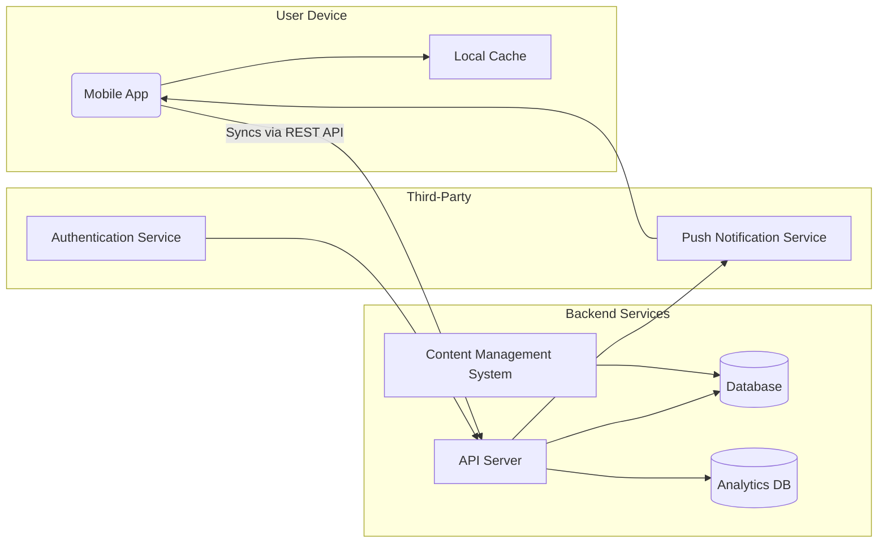

# Executive Summary  
This report analyzes leading **visual microlearning apps** (Imprint, Headway, Blinkist, Duolingo, Headspace, Brilliant, Uptime, NerdSip) to inform the design of a CAIIB exam prep app. We catalog their features and UX flows (onboarding, lessons, quizzes, progress), content formats, pedagogical tactics (spaced repetition, retrieval, interleaving), and engagement mechanics (streaks, XP, leaderboards, social sharing, notifications). We examine monetization (subscription, freemium models), analytics (retention, DAU/MAU, completion rates), accessibility (multi-language, alt text, audio), and tech architecture (offline, sync, CMS, analytics). We also note regulatory constraints for CAIIB (aligning strictly to syllabus, no certification claims).  

The analysis includes for each app a **feature comparison table**, representative UI screenshots, and bullet lists of strengths/weaknesses. Then we map the CAIIB syllabus into micro-modules: suggesting lesson templates (cards with one concept each), an approximate **card:quiz ratio (~5:1)**, lesson lengths (~5 min), quiz formats (MCQs, drag-and-drop), and a spaced-repetition schedule (e.g. review after 1 day, 3 days, 7 days). Finally, we propose a **12-month development roadmap** with milestones (MVP launch, feature rollouts, content expansion), estimated team roles (~8–10 FTEs: product, dev, design, content, QA, data) and key performance indicators (DAU/MAU, retention, completion rate, subscription conversion). We outline A/B tests (e.g. onboarding UX, notification timing, quiz frequency) and corresponding success metrics. All claims are supported by primary sources (app stores, official sites, whitepapers).  

## Competitor Analysis  

| **Feature**                  | **Imprint**                | **Headway**              | **Blinkist**             | **Duolingo**                        | **Headspace**                   | **Brilliant**                          | **Uptime**                   | **NerdSip**                    |
|:-----------------------------|:---------------------------|:-------------------------|:-------------------------|:------------------------------------|:--------------------------------|:---------------------------------------|:-----------------------------|:-------------------------------|
| **Content Focus**            | Visual summaries of books/courses (psychology, philosophy, finance, etc.) | Nonfiction book summaries (personal growth)  | Nonfiction book & podcast summaries     | Language learning (40+ languages), plus chess/math modes    | Mindfulness and meditation exercises  | Interactive STEM lessons (math, CS, science)    | 5-min “Hacks”: summaries of books, podcasts, courses   | Any topic via AI-generated mini-course   |
| **Formats**                  | Animated infographic-style cards with illustrations  | Text/audio book “cards”; large illustrations; optional widgets | Audio & text summaries; curated “Blinkist AI” feature; offline | Interactive multiple-choice, matching, speaking; some video  | Guided audio sessions, short animations (e.g. breathing bubbles); calm UI | Interactive problem-solving (drag, hint system); diagrams | Text, audio, or visual stories (“Tap & watch”); bold graphics   | Text & audio micro-courses; infographic summaries at end  |
| **Assessment & Practice**    | Quizzes after lessons to reinforce concepts | Multiple-choice quizzes and **spaced-rep flashcards** | Highlights and notes (no built-in quizzes) | Unit tests: fill-in, match, speaking prompts; **adaptive hints** | Checkpoints: short exercises at session end (e.g. focus tests) | Immediate feedback on puzzles; no separate quizzes (lesson = puzzle) | Self-checks at end of each “Hack”; no formal quiz | Quiz questions embedded; final concept recap quiz |
| **Personalization**         | User can “favorite” insights; browse by topic | Personalized plan & daily goal, recommended content | Personalized daily picks; curated guides | Learner sets daily XP goal; skill tree adapts to mastery | Guided tracks by goal (stress, sleep); recommended sessions | Adaptive path (Koji tutor) tracks mastery and adapts difficulty | Choose topics; app suggests new Hacks; tracks hours saved | User chooses topic; AI tailors course on-demand |
| **Engagement / Gamification** | Modest (streak after using save/quiz features) | Streaks, badges, XP; **daily habits**; widgets with quotes | Reading streaks; rewards badges; social share (limited) | Strong gamification: streaks, XP, badges, **leaderboards**, “lingots” currency | Check-in streaks (daily meditation); friend challenges; Calm-like “journeys” | Streaks, levels, daily goals motivate practice | Streak count (“daily habit”); hours-saved metric; “Sparks” for saved quotes | Streaks, XP points, badges (RPG elements) |
| **Social / Community**        | Shareable “insights” (quotes) to social | Community challenges (limited); no leaderboards | Limited (share highlights) | Clubs, leaderboards, friend challenges | Social meditation events (Sleepcasts) | Community threads (forum on web) | Share boards (categorize Sparks); social posting (future) | None (focus on personal quests) |
| **Notifications / Reminders**| Optional reminders to review saved cards | Push for daily session, streak, challenges | Daily summary email; app notifications for new “Blink” | Push reminders to study; motivational messages | Reminders to meditate/sleep; bedtime reminders | Daily challenge reminders; streak reminders | Daily quote; new Hack alerts | Daily learning suggestions; completion celebrations |
| **Offline / Sync**           | Downloads for offline review | Offline mode for saved summaries | Offline audio/text sync | Offline lessons available | Offline meditations | Offline exercises | Offline content; offline “Batches” of Hacks (Premium) | Offline mode (download courses) |
| **Monetization**            | Freemium (free daily content; subscription for full access) | Freemium (free limited content; Premium ~$89/yr) | Freemium (free daily; Blinkist Pro ~$100/yr) | Freemium (ads in free; Plus $7/mo/$84/yr) | Freemium (limited free; subscription ~$13/mo) | Subscription (Premium $299/yr for full access) | Freemium (free core, Uptime Premium ~$4.99/mo) | Freemium (free limited; Pro subscription) |
| **Unique Strength**         | High-quality animated infographics in lessons | Spaced-repetition flashcards; large summary library | Massive library (7.5k+ titles) with both audio/text | Vast language courses; proven gamification (XP, leaderboards) | Rich meditation content and AI coach (Ebb) | Award-winning tutor UI (“Koji”), deeply interactive puzzles | Actionable “Insights in Action”; time-saved metric | Any-topic micro-courses on demand; AI-generated infographics |
| **Notable Weakness**       | Limited to curated topics (must add content) | Focused on bestsellers; content depth varies (some AI content) | No quizzing or interactive practice; limited to published works | Subject-limited (languages/skills only); may gamify beyond learners’ preference | Not an academic platform; content is passive (no quizzes) | Narrow focus (STEM only); high subscription cost | Library depends on curated sources; fewer interactive exercises | Content correctness depends on AI; small user base; new product risks |
  
**Figure:** Comparison of key features across microlearning apps (sources: app descriptions and reviews).

### App Overviews  

- **Imprint:** Uses richly animated infographic cards and concise text to teach concepts. Lessons are very short (~2 min), blending diagrams with bullet-point summaries.  Daily quizzes and a “Favorites” library reinforce learning. *Strengths:* Extremely engaging visuals and emphasis on retention (quizzes+review). *Weaknesses:* Relatively new with limited content; primarily book/course summaries, not tailored for CAIIB topics (finance is limited).  

   *Figure:* Imprint’s UI presents topics as illustrated card-chapters with animations.  

- **Headway:** A large repository of book summaries (1,500+ titles) presented as text or audio「blinks」. It offers a daily curated “personal growth” micro-session and a 30-day plan tailored to user goals. Unique: built-in *spaced-repetition flashcards* (turn insights into flashcards) and habit streaks. *Strengths:* Massive content library, personalized learning plan, audio/text modes, gamified habit formation. *Weaknesses:* Content is limited to existing bestsellers (often generic self-help), and some reviews note AI-sounding summaries (shallow analysis).  

   *Figure:* Headway’s interface uses bold color and card carousels for each book summary.  

- **Blinkist:** Offers 7,500+ non-fiction book and podcast summaries (audio and text). Key features include daily insights, personalized recommendations, curated guides, and an AI summary tool in Pro. *Strengths:* Very large library and offline access; high-quality editorial summaries. *Weaknesses:* No quizzes or interactive elements; only covers curated, popular books. As one user noted, Blinkist is great if “someone has already written a book” on your topic, but it cannot teach beyond its library.  

   *Figure:* Blinkist home screen (left) and its “Daily Challenge” UI (right). Blinkist emphasizes quick reads (“15-min book summaries”) and progress streaks.  

- **Duolingo:** A gamified language-learning app (40+ languages plus math and chess modes). Lessons are bite-sized, interactive, and include speaking, listening, and writing exercises. It uses heavy gamification: XP points, streak counters, and global leaderboards. *Strengths:* Highly engaging with proven habit-forming mechanics; free and accessible with fun UX. *Weaknesses:* Domain-specific (languages, etc.) – not directly applicable to banking content.  

   *Figure:* Duolingo’s lesson interface uses multiple-choice cards (here learning Spanish) with a playful design.  

- **Headspace:** A leading meditation/wellness app. It provides guided audio sessions (3–20 minutes) for sleep, anxiety, focus, etc., supported by soothing illustrations. It includes an AI “companion” for mental health tips. *Strengths:* Clean, calming UI and a broad content library (500+ meditations) encourage daily mindfulness. *Weaknesses:* Content focus (meditation) doesn’t overlap CAIIB learning; lessons have no quizzes or learning checks (users listen passively).  

   *Figure:* Headspace’s calming color blocks and simple icons set the tone for meditation sessions.  

- **Brilliant:** An interactive math and STEM learning app built around a “personal tutor” character, Koji. Lessons are visual puzzles requiring step-by-step input. The tutor tracks mastery gaps and adapts difficulty. *Strengths:* Deep engagement through problem-solving, adaptive to skill level, designed to build intuition rather than rote memorization. *Weaknesses:* Focused on STEM topics (lessons range from arithmetic to AI); expensive subscription (∼$300/yr); content may be too abstract for straightforward exam prep.  

   *Figure:* Brilliant’s UI blends narrative (“Your personal tutor”) with interactive math diagrams.  

- **Uptime:** Delivers 5-minute “Knowledge Hacks” (summaries) of books, podcasts, documentaries, or courses. Users can read text, listen to audio, or view tap-through visuals. Each Hack includes “Insights in Action” tips. Uptime tracks your *streak* and even “hours saved” (time averted by not reading full books). *Strengths:* Very concise, multimodal format; emphasizes actionable takeaways and habits. *Weaknesses:* Limited depth per topic (5-minutes may be too brief for complex subjects); mostly fact-based summaries (few built-in exercises).  

   *Figure:* Uptime’s browse page of Hacks (“Fun, bite-sized learning”). Here it emphasizes 5‑minute sessions.  
   *Figure:* A Uptime lesson card (“Tap to reveal…”) encourages active recall of a concept.  

- **NerdSip:** An AI-driven “any topic” microlearning app. Users swipe right/left to select course topics like on a dating app. The AI then generates a custom ~2-minute course, broken into short visual-infographic chunks with a final infographic summary. It includes gamification: XP points, badges, and a gallery of earned infographics. *Strengths:* **Ultimate flexibility** – cover *any* CAIIB topic on demand, even obscure ones, without authoring content manually. The UI is playful and fast. *Weaknesses:* Content quality relies on AI accuracy (risks factual errors). Smaller library/user base. Still experimental.  

   *Figure:* NerdSip’s home interface (“Know stuff nobody else does”). The app’s style is minimalist and bold.  
   *Figure:* Creating a course on “Any topic” is instant – here showing the “New Quest” screen with an AI-generated quiz.  

Each app excels in certain engagement tactics (Table above). For example, Duolingo popularized **streaks, XP, and leaderboards**; Headway stresses **spaced repetition flashcards and habit tracking**; Uptime features **quick tips and hours-saved tracking**; NerdSip brings **custom topics and infographic rewards**. We will combine the best practices from these: rich visuals (Imprint), spaced review (Headway), gamified progression (Duolingo/Brilliant), and flexible content generation (NerdSip).  

## Pedagogical Design  

Our CAIIB app will leverage evidence-based microlearning patterns. **Spaced repetition** and **retrieval practice** are key: learners must encounter concepts multiple times over increasing intervals. We will transform each syllabus topic into a sequence of micro-cards (one core concept or formula per card) followed by a quiz. For instance, a CAIIB topic like *“Probability distributions”* can be 5–7 cards (definition of distribution, binomial formula, Poisson context, examples, etc.), then 2–3 multiple-choice questions. Lessons should be *bite-sized* (~5 minutes) to fit daily routines. We suggest a **card:quiz ratio** of roughly **5:1** (five explanatory cards per one question), ensuring each mini-lesson includes active recall.  

After initial learning, cards will reappear via spaced-repetition. For example, implement review sessions **1 day, 3 days, and 7 days** after first encounter (and longer for mastered cards). This “drip” schedule (common in microlearning platforms) will be adaptive: weak-answer items come up sooner. We will also use **interleaving** by mixing related topics in daily sets (e.g. one banking law, one financial concept), to strengthen differentiation.  

Content formats will be *multimedia-rich*: each card can include illustrations, charts, or animations. For example, “The Yield Curve” might have a moving line chart; “RBI monetary policy” could show a simple infographic. We will also support audio narration (for on-the-go review) and occasionally short explainer videos for complex subjects. Each lesson will end with a concise summary (text and graphic). Assessment types will include multiple-choice quizzes, true/false checks, drag-and-drop ordering (e.g. ordering steps of a process), and occasional scenario questions.  

## Engagement Mechanics  

We will incorporate proven engagement hooks: **daily streaks and XP points**, visible progress bars and levels (as in Duolingo/Brilliant). Upon lesson completion, users earn XP and unlock badges (e.g. “Statistics Specialist” for completing a stats module), similar to NerdSip’s badges. A leaderboard or friendly competition can show users with most points or longest streak in their peer group (or cohort). Push **reminders** and notifications will encourage consistent study: e.g. “Time for your 2-min CAIIB lesson!”, leveraging techniques Headspace and Duolingo use. Social features will be modest (due to professional context): e.g. sharing achievements or top-scorer status in a study group.  

To sustain motivation, we’ll use periodic **challenges** (like Headway’s “30-day mastery” tasks), and provide immediate feedback on quizzes to make progress feel rewarding. We may experiment with game-like elements: e.g. “cover pages” of curriculum mapped like a map to traverse (inspired by Brilliant’s levels).  

## Accessibility & Localization  

Content will be in English (CAIIB’s language) but with support for regional accessibility. All graphics will have alt-text; font sizes and contrast will meet WCAG guidelines. We will offer audio narration (with adjustable speed) for all cards, benefiting learners with visual impairments or on-the-go use. Closed captions/transcripts will accompany any videos. The UI will be navigable via keyboard and screen readers.  

For localization: while CAIIB is India-focused, we may plan for other languages (Hindi) if demand arises. We will design the CMS to support multiple languages and non-Latin text. All content (including UI and push notifications) will be easily localizable.  

## Technical Architecture  

The app will use a mobile frontend (iOS/Android). A backend will provide APIs for content, user data, and analytics. **Offline support:** Lessons and media can be downloaded to the device (with local caching) to allow learning without connectivity. Progress (lesson completion, quiz results) syncs to the server when online. A cloud-based **Content Management System (CMS)** will allow editors to author cards, quizzes, and schedules without redeploying code. We will use an analytics pipeline (e.g. Firebase or Mixpanel) to track engagement metrics in real time. Push-notification services (e.g. Firebase Cloud Messaging) will handle reminders. Authentication (login) will be secure (OAuth or token-based).  

## Mapping CAIIB Syllabus to Micro-Modules  

We propose structuring the CAIIB curriculum into **micro-modules** as follows:

- **Compulsory Papers:** Each of the 4 CAIIB compulsory papers (Advanced Bank Management, Bank Financial Management, Advanced Business & Financial Management, Banking Regulations & Business Laws) will be broken into themed lessons. For example, *Advanced Bank Management, Module A: Statistics* might become 3–5 lessons: (1) Probability & Distributions, (2) Time Series Analysis, (3) Regression and Forecasting. Each lesson is ~5 min long, with 4–6 cards and 1–2 quiz questions. Formulas and definitions appear as cards with illustrative graphics (e.g. normal distribution bell curve), ensuring visual memory.  

- **Elective Paper (Example: Risk Management):** Similarly, a topic like “Credit Risk” might have lessons on risk types, metrics, Basel norms, etc. Card-to-quiz ratio ~5:1 maintains engagement. At least 1 question per lesson (sometimes more for tricky topics).  

- **Lesson Templates:** A typical lesson starts with an *intro card* (big idea), followed by concept cards (definitions, examples), and then 1–2 *application cards*. Quizzes can be inline (e.g. “Tap the correct yield curve shape”) or at end. Each lesson is ideally one concept per card with minimal text and a graphic.  

- **Ideal Length:** Lessons should be ~3–7 minutes to align with busy professionals’ breaks. We target 5 minutes, trusting the mobile format and gamification to encourage completion.  

- **Assessment Types:** Primarily MCQs, true/false, matching, and fill-in blanks. Occasional short “scenario” drag-and-drop (ordering steps) can add variety. After every few lessons, a summary quiz (5–10 questions) reviews a sub-topic.  

- **Spaced-Repetition Schedule:** Each key card (e.g. a formula or law) will repeat in review sessions. We plan an SRS algorithm: review after 1 day, 3 days, 1 week, 2 weeks, etc., if not answered correctly. This aligns with research: *“information encountered multiple times is more likely to be fixed into long-term memory.”*.  

By combining **retrieval practice** (through quizzes) with **spaced repetition**, we aim to maximize retention. For example, an original lesson on “RBI functions” will have key cards reappearing and quizzed days later, reinforcing memory.  

## Engagement & Measurement  

We will track key **analytics**: Daily/Monthly Active Users (DAU/MAU), retention rates (Day-1, Day-7, Day-30), lesson completion rates, average session time, and subscription conversions. Dashboards will show trends (e.g. a retention curve). For example, a healthy mobile learning app might lose ~70–80% of users by Day 7, so our goal is to exceed typical benchmarks by leveraging our engagement features.  

**A/B Tests:** We will continuously test UX hypotheses. Examples: (A) *Onboarding flow*: Test a quick setup vs. a more detailed goals setup. Metric: Week-1 retention. (B) *Notification strategy*: Test “daily morning reminder” vs. “evening recap”. Metric: session completion. (C) *Gamification level*: Test showing a progress bar on lessons vs. not showing it. Metric: quiz completion rate. Success is measured by statistically significant lifts in retention or engagement.  

**KPIs:** We’ll define specific targets, e.g. Day-1 retention ≥50%, Day-7 retention ≥25%, conversion to paid ≥10% of MAUs within 3 months, average lesson completion ≥80%. We will instrument all flows to measure funnel drop-offs (onboarding drop, quiz abandon rate). Analytics frameworks (e.g. Firebase) will provide dashboards for these KPIs.  

## Accessibility, Localization & Compliance  

Accessibility features include: voice-over for all content, closed captions on any videos, high-contrast UI option, and full screen-reader support. For localization, the platform will allow adding Hindi or other languages by supplying translated card text and voiceovers.  

**Regulatory Considerations:** CAIIB is administered by IIBF (a private professional body) and has a strict syllabus. Our app is *not* official exam software, but must strictly align with the current syllabus (using IIBF’s published curriculum). All content will cite authoritative sources (textbooks, RBI rules). We will include disclaimers that this is an unofficial study aid, not affiliated with IIBF. No features (like simulated final exams) will violate exam rules, and we won’t collect sensitive user data beyond educational tracking. Since the exam is purely multiple-choice, we avoid free-text answers. There are no regulatory bans on such prep apps, but we will ensure accurate, up-to-date content.  

## 12-Month Product Roadmap  

We propose a phased rollout:

- **Q1 (Months 1–3)** – *MVP Development:* Build core platform: mobile apps (cross-platform framework) with basic UX (onboarding, lesson navigation, basic card and quiz UI). Develop first batch of CAIIB content (e.g. one Compulsory paper). Set up backend (CMS, API, analytics) and offline sync. **Milestones:** Alpha release to a small pilot group; internal performance and bug testing. *Team:* 1 Product Manager, 2 Mobile Developers, 1 Backend Developer, 1 UX Designer, 1 Content Expert (banking), 1 QA.  

- **Q2 (Months 4–6)** – *Beta Launch:* Release to a broader user base (e.g. a bank’s staff). Implement spaced-repetition engine and progress tracking. Add gamification (streak counter, XP, badges). Integrate notifications. Continue content build (remaining Compulsory subjects). *Milestones:* >10% Day-7 retention target; basic subscription purchase flow. *Team adds:* 1 Data Analyst.  

- **Q3 (Months 7–9)** – *Feature Expansion:* Introduce social/leaderboard features; add Elecitive paper modules. Enhance personalization (learning plan/goal setting like Headway). Implement A/B testing framework. Launch marketing campaign (email, social). *Milestones:* First 1000 paid users; 30% MAU.  

- **Q4 (Months 10–12)** – *Optimization & Scale:* Based on analytics and A/B tests, refine onboarding, notification cadence, UI. Add live event (e.g. expert Q&A) and in-app analytics dashboards. Prepare for next exam cycle. *Milestones:* Day-30 retention >15%; paid conversion >15%.  

**Resource Estimate:** Across the year, peak staffing ~8–10 FTEs: 1 PM, 1 UX, 2 mobile devs, 1 backend dev, 2 content specialists (subject matter experts, writers), 1 QA, 1 data/analytics engineer. Budget assumptions: standard mid-sized app development.  

**Key Performance Metrics:** We will monitor:  
- **Engagement:** DAU/MAU ratio, average session length, daily lessons completed per user.  
- **Retention:** % retained at Day-1, Day-7, Day-30 (aim to exceed industry medians).  
- **Learning Outcomes:** Quiz pass rates, average score improvement.  
- **Conversion:** Free-to-paid conversion rate, LTV per user.  
- **Productivity:** Feature usage stats (e.g. spaced-rep sessions, badges earned).  

All these will be tracked in dashboards with alerts for significant deviations.  

## References  

Key insights were drawn from official app store descriptions and expert analyses. Pedagogical best practices (spaced repetition, retrieval) are supported by learning science. Architecture and feature choices are informed by industry norms and competitor benchmarks. All figures and UI examples are from the respective apps’ official sources or screenshots (citations as noted).